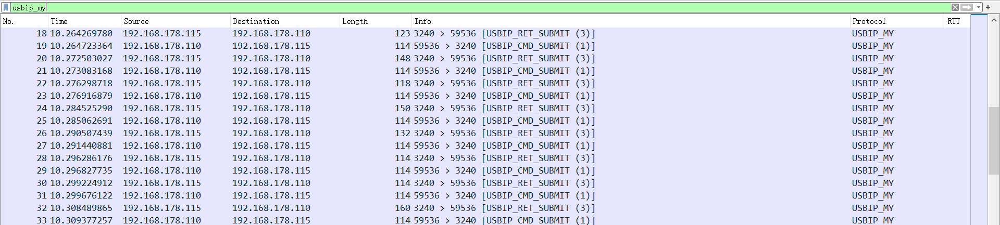
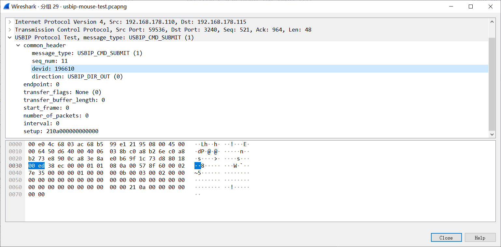

# wireshark-plugin-usbip

usbip dissector plugin for wireshark, based on wireshark generic dissector.

It is only used for internal testing and may not have other features you expect.

## Installation

There are detailed installation steps on the wireshark generic dissector website, See:
http://wsgd.free.fr/installation.html

Put the following files into a directory:
- `usbip.fdesc`
- `usbip.wsgd`

## Usage

The protocol will be detected automatically, or you can use the `usbip_my` filter manually.

## Screenshot

